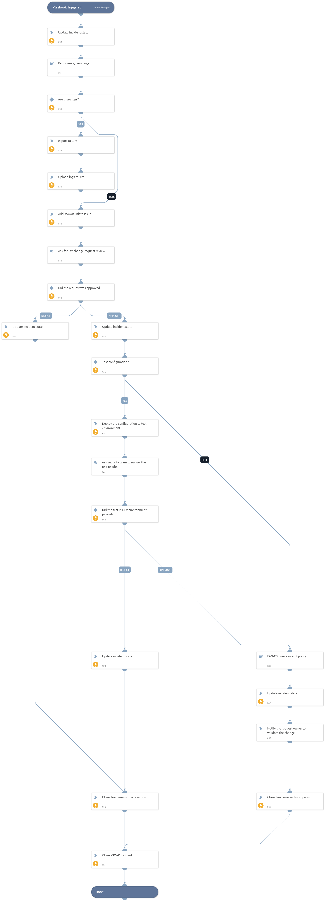

If you are using Pan-os/panorama firewall and Jira as a ticketing system this playbook will be a perfect match for your change management for FW process.
This playbook will be triggered by fetch from Jira and will help you manage and automate you change management process.

## Dependencies
This playbook uses the following sub-playbooks, integrations, and scripts.

### Sub-playbooks
* Panorama Query Logs
* PAN-OS create or edit policy

### Integrations
This playbook does not use any integrations.

### Scripts
* ExportToCSV

### Commands
* panorama-create-rule
* setIncident
* closeInvestigation
* jira-issue-upload-file
* jira-edit-issue
* jira-issue-add-comment

## Playbook Inputs
---

| **Name** | **Description** | **Default Value** | **Required** |
| --- | --- | --- | --- |
| TicketSummary | Provide a summery for your firewall request. | incident.details | Optional |
| SecurityTeamEmail | The email of the security team that approves the FW requests. |  | Optional |
| log_type | Log type to query. Can be: traffic, threat, wildfire, url or data-filtering. | traffic | Optional |
| query | The query string by which to match criteria for the logs. This is similar to the query provided in the web interface under the Monitor tab when viewing the logs. |  | Optional |
| addr-src | Source address. | incident.sourceips | Optional |
| addr-dst | Destination address. | incident.destinationips | Optional |
| port-dst | Destination port. | incident.dstports | Optional |
| TestConfigurations | By providing YES to this input the requested FW rule will be tested in your test environment. | No | Optional |
| zone-src | Firewall source zone. | incident.sourcenetworks | Optional |
| zone-dst | Firewall destination zone. | incident.destinationnetworks | Optional |
| TestInstance | The instance name of the FW in DEV environment for testing the new rule. |  | Optional |
| Action | The action for the change request | incident.policyactions | Optional |
| Protocol | The IP protocol. | incident.protocol | Optional |
| Log_forwarding | Log forwarding profile. |  | Optional |
| Profile_setting | A profile setting group. |  | Optional |
| Service | A comma-separated list of service object names for the rule. | incident.protocolnames | Optional |
| Application | A comma-separated list of application object names for the rule to create. |  | Optional |
| Rulename | Name of the rule to create. |  | Optional |
| Description | Set the description of the ticket. | incident.description | Optional |
| Time-generated | The time the log was generated from the timestamp and prior to it. For example: "2019/08/11 01:10:44". |  | Optional |
| Rule_position | Pre rule or Post rule \(Panorama instances\). Possible options: - post-rulebase - pre-rulebase |  | Optional |
| Closing_status_rejected | The closing status in Jira is changing by the  project templates, please provide the relevant closing status if the issue was rejected.  |  | Optional |
| Closing_status_approved | The closing status in Jira is changing by the  project templates, please provide the relevant closing status if the issue was approved. |  | Optional |
| Target | Target number of the firewall. Use only on a Panorama instance. |  | Optional |
| Vsys | Target vsys of the firewall. Use only on a Panorama instance. |  | Optional |

## Playbook Outputs
---
There are no outputs for this playbook.

## Playbook Image
---
